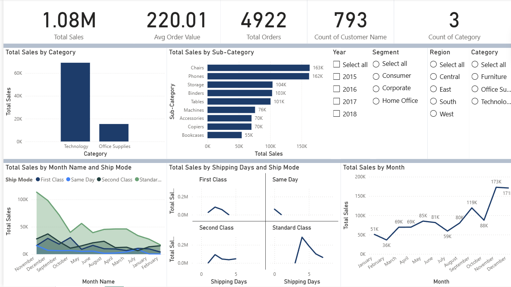
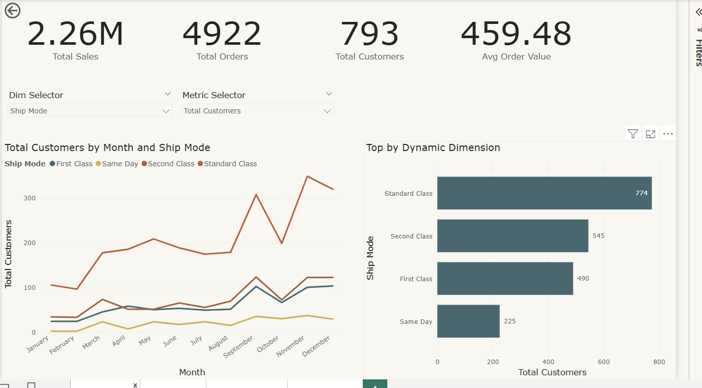

README.md

Title
PowerBI Retail Sales Dashboards

Overview
This project analyzes retail sales with three progressively enhanced Power BI dashboards: a baseline overview (V1), an interactive Version 2 with drill-through, report page tooltips, and dropdown slicers, and a Version 3 that adds a distribution chart for deeper analysis. The dashboards surface KPIs, category/sub-category performance, shipping behavior, and monthly trends across segments and regions.

Dataset
The dataset contains order-level retail transactions with fields such as Order ID, Order Date, Ship Date, Segment, Region, Category, Sub-Category, Ship Mode, and Sales/Orders/Customers measures, covering 2015–2018 sample periods. Visuals are built from a single “train” table with a Calendar table for month sorting.

Tools Used

Power BI Desktop for data modeling, measures, and report authoring.

Preview

Version 1 — Baseline dashboard

KPIs, sales by Category and Sub-Category, monthly sales trends, and shipping breakdown.

Preview: (V1)

Version 2 — Interactivity upgrade

Added drill-through to “Item Details”, report page tooltips, dropdown slicers (field parameters: Dim Selector, Metric Selector).

Previews: (V2)

Usage

Download and install Power BI Desktop.

Clone this repository with LFS enabled:

git lfs install && git clone <repo-url> && cd <repo-folder> && git lfs pull

Open the desired .pbix (File > Open) and interact with slicers, drill-through, and tooltips.

What’s New by Version

V1

Baseline KPIs and visuals for categories, sub-categories, shipping modes, and month trends.

V2

Drill-through details page with Back button, report page tooltips, dropdown slicers via Field Parameters (Dim/Metric Selectors).

